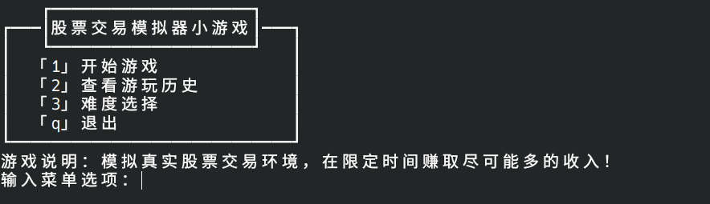
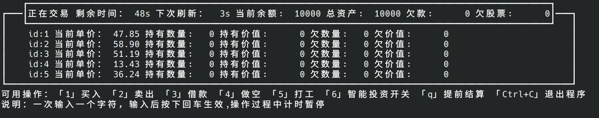
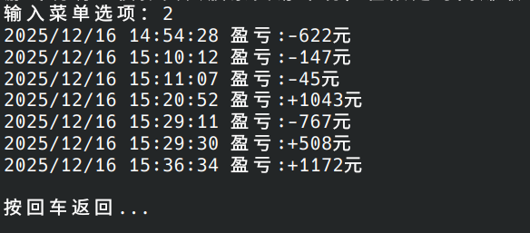

# 股票交易模拟器小游戏

## 编译：

[howtobuild.md](howtobuild.md)

## 介绍：

本项目是一个在Linux终端中运行的股票交易模拟器小游戏，想法来自于`原神千星奇域-璃月黄金交易所`（UGC二创小游戏），本项目使用C语言在终端中实现该小游戏的核心玩法。

主要玩法：通过买入和卖出股票来获取利润，可以借款，也能做空，通过游戏模拟了解市场交易基本操作。

详细见：[项目结构](项目结构.md)

ps:你也可以不购买股票，通过打工（做数学题）赚钱，同时我们也提供了智能投资功能搭配食用

