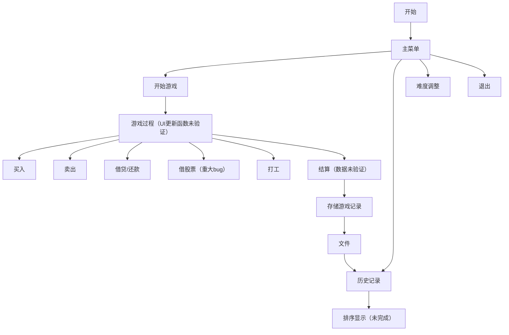

# 股票交易模拟器

```mermaid
graph TD
    A[开始]--> B[主菜单]--> C[开始游戏]
    B-->D[历史记录]
    B-->E[难度调整]
    B-->F[退出]
    C-->G[游戏过程（UI更新函数未验证）]
    G-->H[买入]
    G-->I[卖出]
    G-->J[借贷/还款]
    G-->K[借股票（重大bug）]
    G-->L[打工]
    G-->M[结算（数据未验证）]-->N[存储游戏记录]-->O[文件]-->D
    D-->P[排序显示（未完成）]
```
* 数据未验证是由于借股票模块的bug暂时无法进行
<!--
## 主函数&UI

- 初始化程序
- 显示游戏菜单主界面
- 游戏过程中UI

## 股票信息处理

- 随机生成股票信息，控制在合理范围涨跌

## 数据存读相关

- 存储/读取游玩历史

## 操作功能函数

- 买入
- 卖出
- 借贷/还款
- 做空相关
- 打工

-->